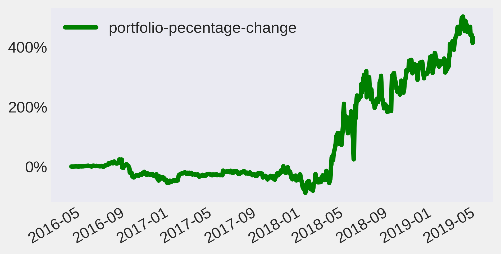

# Vietnam stock market on Quantopian

## Motive
When I started to conduct some preliminary research in the field of algorithmic trading, the name Quantopian seemed to be the most searched company on the internet.

Quantopian's web-based product is written in Python. Parts of the company's technology are available under an open-source license, in particular, their back-test engine dubbed "Zipline."

Moreover, there are hundreds of free-to-run trading algorithms in their community; therefore, it is wise to begin a long journey by following the experts.

However, currently, the "Zipline" library does not support to back-test the stock exchange in Vietnam. That is the reason for my work to adapt several core components of "Zipline" to fit with the local exchange calendar and to ingest the local market data.

The series of posts I did is on my LinkedIn page.

[Part I](https://www.linkedin.com/pulse/%E1%BB%A9ng-d%E1%BB%A5ng-thu%E1%BA%ADt-to%C3%A1n-trong-%C4%91%E1%BA%A7u-t%C6%B0-c%E1%BB%95-phi%E1%BA%BFu-vi%E1%BB%87t-nam-i-t%C4%83ng-qu%E1%BB%91c-th%C3%A1i/)

[Part II](https://www.linkedin.com/pulse/%E1%BB%A9ng-d%E1%BB%A5ng-thu%E1%BA%ADt-to%C3%A1n-trong-%C4%91%E1%BA%A7u-t%C6%B0-c%E1%BB%95-phi%E1%BA%BFu-vi%E1%BB%87t-nam-ii-t%C4%83ng-qu%E1%BB%91c-th%C3%A1i/)

[Part III](https://www.linkedin.com/pulse/%E1%BB%A9ng-d%E1%BB%A5ng-thu%E1%BA%ADt-to%C3%A1n-trong-%C4%91%E1%BA%A7u-t%C6%B0-c%E1%BB%95-phi%E1%BA%BFu-vi%E1%BB%87t-nam-iii-t%C4%83ng-qu%E1%BB%91c-th%C3%A1i/)

